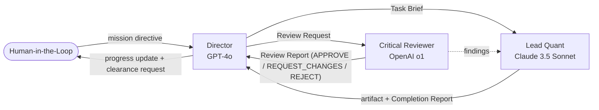

# walmart-challange — YipitData Signal Validation

> **Does the FRED monthly retail-sales index (RSXFS) predict Walmart's quarterly revenue better
> than a Seasonal Naive Baseline?** A 3-persona agentic team — Director (GPT-4o), Lead Quant
> (Claude 3.5 Sonnet), Critical Reviewer (OpenAI o1) — runs a leakage-free, out-of-sample
> evaluation under strict guardrails and produces a notebook + executive memo + prompt log.

Built on the governance model from [`wojciechkrukar/agentic-workforce-kernel`](https://github.com/wojciechkrukar/agentic-workforce-kernel).

---

## What this repo solves

A YipitData take-home exercise treated as a real customer engagement: a portfolio manager wants
to know whether a public macro signal (FRED RSXFS) adds anything beyond a dumb seasonal-naive
forecast for Walmart revenue. The answer must be honest, falsifiable, leakage-free, and
robust to the 2020 COVID structural break. See
[`docs/projects/yipitdata-signal/challenge-brief.md`](docs/projects/yipitdata-signal/challenge-brief.md)
for the full restatement of the customer's question.

## The orchestration



The Director is the only agent that talks to the human. The Lead Quant is the only agent that
writes analysis code. The Critical Reviewer is the only agent that approves an artifact for
sign-off. Long-form role definitions live in [`docs/team/roles.md`](docs/team/roles.md);
short-form system prompts in [`.agent/`](.agent/).

## Mission status

The mission is **`COMPLETE`**. The final analysis artifacts, including the notebook outputs,
executive memo, prompt log, and benchmark deliverables, have been produced and committed.
[`runtime/agent_handoffs/current_mission.md`](runtime/agent_handoffs/current_mission.md)
records the completed mission state.

See [`TODO.md`](TODO.md) for the final work tracker and [`docs/milestones.md`](docs/milestones.md)
for the milestone view.

## Hard guardrails

The Critical Reviewer fails any artifact that violates these. Restated from the mission
directive:

1. **No APIs.** Read only `data/retail_sales_fred.csv` and `data/walmart_revenue.csv`.
2. **Baseline imperative.** A formal Seasonal Naive Baseline is built **before** any alternative model.
3. **Zero look-ahead.** Predictors for quarter Q must have been physically published before quarter Q starts.
4. **Out-of-sample only.** Strict forward-rolling time-series CV. No randomised K-fold. In-sample R² is not a result.
5. **Causal "why" + structural breaks.** The 2020 COVID disruption gets explicit regime treatment, not a fitted line through it.

The full audit checklist the Reviewer applies on every Task lives in
[`todos/T999-reviewer-audit-checklist.md`](todos/T999-reviewer-audit-checklist.md).

## Repository layout

```
.agent/                                         # Short-form system prompts for the 3 personas
challange_docs/                                 # Original challenge brief artifacts (immutable evidence)
data/                                           # The two source CSVs — read-only for all agents
docs/
├── kernel/                                     # Vendored governance docs (read-only)
├── team/                                       # Project-extension governance docs
├── projects/yipitdata-signal/                  # YipitData challenge brief, methodology, KPIs, caveats
├── llm-roster.md                               # Tier matrix per persona (locked to directive's Tier-1)
├── milestones.md                               # M0 → M6 mission tracker
└── delivery_kpis.md                            # Per-milestone exit criteria
todos/                                          # One Markdown file per Task Brief (T001 → T006, T999)
runtime/
├── agent_handoffs/current_mission.md           # Live mission state; HITL writes decisions here
├── benchmarks/                                 # Cached numerical results (baseline.json, oos_errors.json)
├── logs/                                       # Append-only event log (any agent)
├── run_reports/                                # Director-authored mission run reports
└── validation/                                 # Critical Reviewer's per-Task Review Reports
TODO.md                                         # Director-owned live work tracker
WALKTHROUGH.md                                  # How to run / orchestrate the team
analysis.ipynb                                  # Lead Quant's notebook (currently a stub — BLOCKED)
memo.md                                         # Executive memo (currently a stub — BLOCKED)
prompts.md                                      # Prompt log + reflection (currently a stub — BLOCKED)
```

## Where to start reading

1. [`docs/projects/yipitdata-signal/challenge-brief.md`](docs/projects/yipitdata-signal/challenge-brief.md) — the customer question and the binding guardrails.
2. [`docs/team/roles.md`](docs/team/roles.md) — the three personas and their forbidden actions.
3. [`docs/projects/yipitdata-signal/methodology.md`](docs/projects/yipitdata-signal/methodology.md) — the analytical plan the Lead Quant will follow.
4. [`runtime/agent_handoffs/current_mission.md`](runtime/agent_handoffs/current_mission.md) — current Director-to-HITL message.
5. [`WALKTHROUGH.md`](WALKTHROUGH.md) — how the orchestration is actually run.
