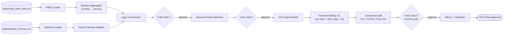

# walmart-challange — YipitData Signal Validation

> **Mission:** Evaluate whether the FRED RSXFS retail-sales index predicts Walmart quarterly revenue better than a Seasonal Naive Baseline. Strict guardrails: no APIs, baseline-before-model, zero look-ahead, OOS-only, COVID structural break explicitly handled.

Built on the governance model from [`wojciechkrukar/agentic-workforce-kernel`](https://github.com/wojciechkrukar/agentic-workforce-kernel) — same pattern used by `wojciechkrukar/lex-triage-agent`.

---

## Headline finding

> On a strict out-of-sample, lag-aligned forward-rolling cross-validation, the FRED RSXFS index **beats** the Seasonal Naive Baseline on the **Pre-COVID** sample (MAPE 1.29% vs. 2.02%, ~36% improvement) and on the **Ex-COVID** sample (2.11% vs. 2.42%, ~13% improvement). On the **full sample** including COVID, the signal **does not beat** the baseline (2.49% vs. 2.36%) because the 2020 structural break dominates the test errors.

Full numbers are frozen in [`runtime/benchmarks/baseline.json`](runtime/benchmarks/baseline.json). Full reasoning is in [`memo.md`](memo.md).

---

## Agentic team

| Role | LLM (Tier 1) | Owns |
|------|-------------|------|
| **Director (Orchestrator)** | Claude Opus 4.7 | Decomposition, guardrails, HITL communication, run reports |
| **Lead Quant (Generator)** | Claude Opus 4.7 | Every cell of `analysis.ipynb`, the memo, the figures |
| **Critical Reviewer (Adversary)** | Claude Opus 4.6 | Every Phase-exit verdict, the `guardrail_violations` field |

The HITL communicates **only** with the Director. See [`docs/team/roles.md`](docs/team/roles.md) for long-form mission per agent and [`docs/llm-roster.md`](docs/llm-roster.md) for the model-selection rationale.

---

## Pipeline



Every gate is a Critical Reviewer verdict. See [`docs/projects/walmart-signal-validation/architecture.md`](docs/projects/walmart-signal-validation/architecture.md) for the concrete `MissionState` schema and the fiscal-quarter mapping table.

---

## Repository layout

```
analysis.ipynb                                Lead Quant deliverable — end-to-end notebook
memo.md                                       One-page executive memo for the portfolio manager
prompts.md                                    Director's orchestration log + reflection
WALKTHROUGH.md                                Top-level technical walkthrough of the system
TODO.md                                       Director's #TODO:/#DONE: tracker
requirements.txt                              Pinned Python deps
data/                                         Read-only source CSVs (FRED + Walmart)
challange_docs/                               Original Mission Brief inputs from HITL

docs/
├── kernel/                                   Vendored from agentic-workforce-kernel — universal contracts
│   ├── README.md
│   ├── director_protocol.md
│   ├── task_contracts.md
│   ├── escalation_matrix.md
│   ├── review_policy.md
│   ├── state_model.md
│   └── command_grammar.md
├── team/                                     Project-specific extensions of the kernel
│   ├── roles.md                              ← long-form role definitions for the 3 agents
│   ├── director_protocol.md
│   ├── escalation_matrix.md
│   ├── task_contracts.md                     Task Brief / ICR / Critic Verdict / Final-Memo templates
│   ├── review_policy.md                      PR class matrix + Critic six-probe checklist
│   └── collaboration.md                      Branch naming, who-touches-what, parallel rules
├── projects/walmart-signal-validation/       Mission-specific specs
│   ├── README.md
│   ├── architecture.md                       Pipeline diagram + MissionState schema
│   ├── agents.md
│   ├── creator-critic-pairs.md
│   ├── kpis.md                               Strict KPI priority + 8 hard guardrails
│   ├── evaluation-harness.md                 Forward-rolling CV spec
│   ├── structural-breaks.md                  COVID-19 handling protocol
│   ├── phase-1-plan.md
│   ├── phase-2-plan.md
│   └── telemetry.md
├── llm-roster.md                             Authoritative tier matrix per role + rationale
├── milestones.md                             Skyfall-style milestone tracker (M0–M7)
└── delivery_kpis.md                          Per-milestone exit-criteria checklists

runtime/
├── agent_handoffs/current_mission.md         Director's in-flight status
├── benchmarks/baseline.json                  Frozen OOS metrics (the verdict numbers)
├── logs/                                     Append-only per-Task JSONL logs
├── run_reports/                              Per-Mission summaries
│   └── 2026-05-13-walmart-signal-validation.md
└── validation/                               Critic adversarial probe artifacts
```

---

## Quickstart

```bash
# Install deps
pip install -r requirements.txt

# Re-run the analysis end-to-end (must complete with no errors)
jupyter nbconvert --to notebook --execute --inplace analysis.ipynb

# Inspect the frozen verdict
cat runtime/benchmarks/baseline.json | python -m json.tool
```

Reproducibility is part of the contract: re-running the notebook must produce byte-identical OOS metrics in the verdict cell.

---

## Documentation

- **[WALKTHROUGH.md](WALKTHROUGH.md)** — top-to-bottom explanation of the system
- **[memo.md](memo.md)** — one-page executive summary
- **[docs/projects/walmart-signal-validation/](docs/projects/walmart-signal-validation/)** — Mission specs
- **[docs/team/roles.md](docs/team/roles.md)** — long-form agent role definitions
- **[docs/llm-roster.md](docs/llm-roster.md)** — LLM-per-role assignments + rationale
- **[docs/kernel/](docs/kernel/)** — vendored universal governance contracts (read-only)
