# Architecture — walmart-signal-validation

## Pipeline overview

```mermaid
graph LR
    A[(data/retail_sales_fred.csv)] --> B[FRED Loader]
    C[(data/walmart_revenue.csv)] --> D[Walmart Loader]
    B --> E[Quarter Aggregator<br/>monthly → fiscal Q]
    D --> F[Fiscal Calendar Mapper<br/>Walmart FY ends Jan]
    E --> G[Lag Constructor<br/>FRED at t-1, growth at t-1]
    F --> G
    G --> H{Phase Gate 1<br/>Critical Reviewer}
    H -- approve --> I[Seasonal Naive Baseline<br/>Q&#40;t&#41; = Q&#40;t-4&#41; * 1+mean YoY]
    I --> J{Phase Gate 2<br/>baseline frozen}
    J -- approve --> K[OLS Signal Model<br/>lagged FRED + YoY]
    K --> L[Forward-Rolling CV<br/>min train = 16Q, step = 1Q]
    L --> M[Sub-period split<br/>Pre-COVID / COVID / Post / Ex-COVID]
    M --> N{Phase Gate 5<br/>COVID audit}
    N -- approve --> O[Memo + Notebook]
    O --> P([HITL Final Approval])
```



Every gate is a Critical Reviewer verdict. The HITL communicates only with the Director.

## Concrete `MissionState` schema (TypedDict)

```python
class WalmartSignalState(TypedDict):
    # Identity
    mission_id: str            # "WAL-2026-05-13"
    task_id: str | None

    # Inputs (read-only paths)
    fred_csv: str              # "data/retail_sales_fred.csv"
    walmart_csv: str           # "data/walmart_revenue.csv"

    # Phase 1 artifacts
    fred_quarterly: "pd.DataFrame | None"   # FRED aggregated to fiscal Q ending Jan
    walmart_quarterly: "pd.DataFrame | None"

    # Phase 2 artifacts (baseline)
    baseline_predictions: "pd.Series | None"
    baseline_mape: float | None
    baseline_rmse: float | None
    baseline_mean_yoy: float | None         # μ used in Q(t) = Q(t-4)*(1+μ)

    # Phase 3 artifacts (signal model)
    signal_model_summary: str | None        # statsmodels .summary().as_text()
    signal_features: list[str]              # ["fred_yoy_lag1", "walmart_yoy_lag1", ...]

    # Phase 4 artifacts (OOS CV)
    cv_predictions: "pd.DataFrame | None"   # one row per OOS quarter
    cv_mape_full: float | None
    cv_rmse_full: float | None
    cv_mape_precovid: float | None
    cv_mape_excovid: float | None

    # Phase 5 artifacts (COVID)
    covid_window: tuple[str, str]           # ("2020-Q1", "2021-Q1")
    structural_break_documented: bool

    # Critic outputs
    critique: str | None
    critic_score: float | None
    guardrail_violations: list[str]         # MUST be empty before any phase exit

    # HITL
    hitl_required: bool
    human_decision: str | None              # approve | reject | reclassify | abort

    # Telemetry
    total_cost_usd: float
    total_latency_ms: int
    model_calls: list[dict]
    errors: list[str]
```

## Fiscal-quarter mapping (chokepoint)

Walmart's fiscal year ends end-of-January, so:

| Walmart fiscal Q | Calendar months covered | FRED months used as lag-1 features |
|------------------|------------------------|-------------------------------------|
| Q1 FY26 (ends Apr) | Feb–Apr | Nov–Jan (prior) |
| Q2 FY26 (ends Jul) | May–Jul | Feb–Apr |
| Q3 FY26 (ends Oct) | Aug–Oct | May–Jul |
| Q4 FY26 (ends Jan) | Nov–Jan | Aug–Oct |

**The 1-quarter lag is the single chokepoint that prevents look-ahead bias.** The lag-construction cell in `analysis.ipynb` is the only place this mapping lives. The Critical Reviewer audits that cell before any model is fitted.

## Read-only data invariant

`data/*.csv` is loaded by `pd.read_csv` only. No transformation is ever written back to disk under `data/`. All derived series live in memory inside the notebook or are emitted as figures / `runtime/benchmarks/baseline.json`.
